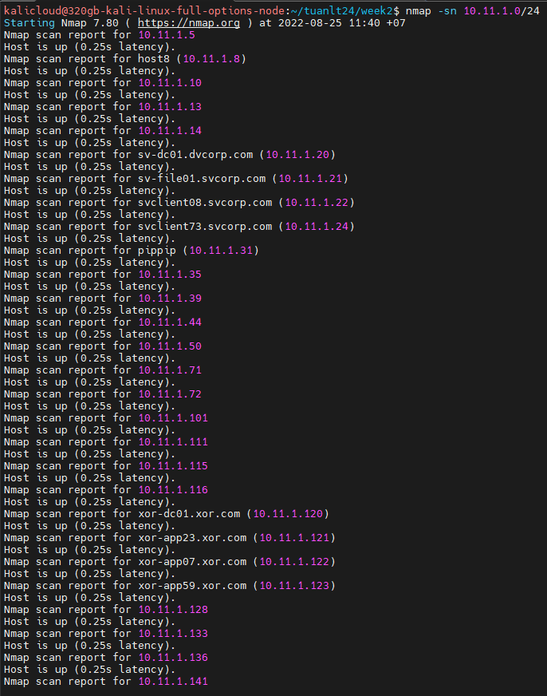
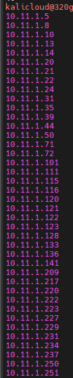
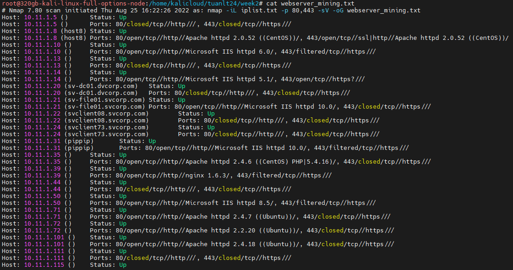
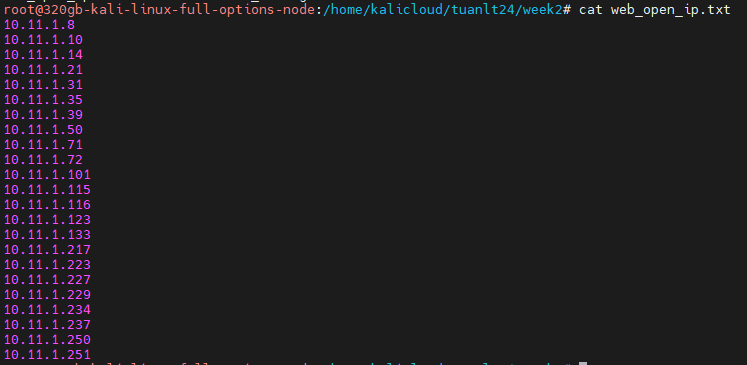
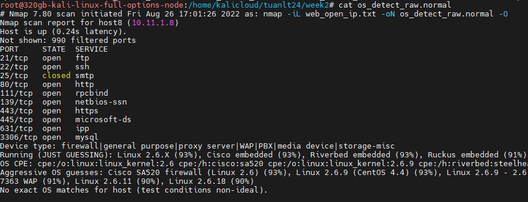

# 1

## Ping sweep để kiểm tra các host online  

ip range: 10.11.1.0/24  
`nmap -sn 10.11.1.0/24 -oG ping_sweep.txt`
Kết quả:  
  

## Lưu vào file  

`nmap -sn -oG ping_sweep.txt 10.11.1.0/24`

Kết quả cat ping_sweep.txt  

## Dùng grep để show kết quả các host up

`cat ping_sweep.txt|grep Up | awk '{print $2}'`

kết quả:  

## 2  Scan các ip tìm được ở bài 1 để tìm webserver ports. Dùng nmap để xác định phiên bản webserver và os  

Kiểm tra các port 80.443 để kiểm tra host nào có dịch vụ webserver đang bật, lưu vào file webserver_mining.txt:

`nmap -p 80,443 10.11.1.0/24 -oG webserver_mining.txt`

Sau đó lọc các host đang có dịch vụ web open, lưu vào file web_open_ip.txt: 

`cat webserver_mining.txt | grep open | awk '{print $2}' > web_open_ip.txt`

Scan thông tin OS của các host có webserver đang bật:  

`nmap -O -iL web_open_ip.txt -oG os_detect_raw.txt`

