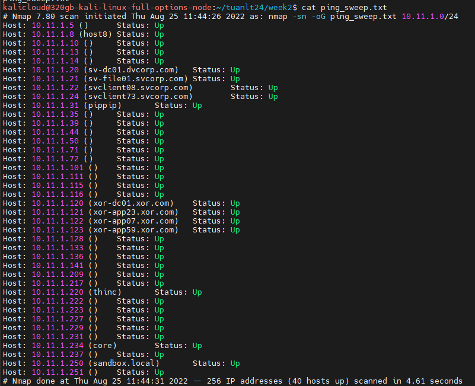

# 1

## Ping sweep để kiểm tra các host online  

ip range: 10.11.1.0/24  
`nmap -sn 10.11.1.0/24 -oG ping_sweep.txt`
Kết quả:  
  

## Lưu vào file  

`nmap -sn -oG ping_sweep.txt 10.11.1.0/24`

Kết quả cat ping_sweep.txt  


## Dùng grep để show kết quả các host up

`cat ping_sweep.txt|grep Up | awk '{print $2}'`

kết quả:  


## 2  Scan các ip tìm được ở bài 1 để tìm webserver ports. Dùng nmap để xác định phiên bản webserver và os  

Kiểm tra các port 80.443 để kiểm tra host nào có dịch vụ webserver đang bật, lưu vào file webserver_mining.txt:

`nmap -p 80,443 10.11.1.0/24 -oG webserver_mining.txt`


Sau đó lọc các host đang có dịch vụ web open, lưu vào file web_open_ip.txt: 

`cat webserver_mining.txt | grep open | awk '{print $2}' > web_open_ip.txt`


Scan thông tin OS của các host có webserver đang bật:  

`nmap -O -iL web_open_ip.txt -oG os_detect_raw.txt`


## 3 Dùng nse script để scan những máy đang chạy smb 

`nmap --script /home/kalicloud/test/smb.nse 10.11.1.0/24 -oN smb_nse.txt`  

Lọc output bằng script:

```bash
#!/bin/bash
for i in {1..254}
do
    output=$(nmap --script /home/kalicloud/test/smb.nse 10.11.1.$i)
    if [[ $output != *"ERROR"* && $output == *"Host script results:"* ]]; then 
        printf $output >> smb_scan.txt
    fi
done
```

# 2   

## 1: lọc các lab chạy windows và smb  

```bash
#!/bin/bash
for i in {1..254}
do
    output=$(nmap --script /home/kalicloud/test/smb.nse 10.11.1.$i)
    if [[ $output != *"ERROR"* && $output == *"Host script results:"* && $output == *"Windows"* ]]; then 
        echo $output | grep "Nmap scan report for" >> listip.txt
    fi
done
```

Kết quả: 


## 2: Scan smb vulner by script nse

Dùng awk lọc các ip từ kết quả lưu vào file listip2.txt

`cat listip.txt | awk '{print $15}' > listip2.txt`

Dùng nse script để quét lỗi trên ip đã lọc được

`nmap --script /usr/share/nmap/scripts/smb-security-mode.nse -iL listip2.txt`

Kết quả: 

```txt
Starting Nmap 7.80 ( https://nmap.org ) at 2022-08-28 23:17 +07
Nmap scan report for svclient08.svcorp.com (10.11.1.22)
Host is up (0.25s latency).
Not shown: 996 closed ports
PORT     STATE SERVICE
135/tcp  open  msrpc
139/tcp  open  netbios-ssn
445/tcp  open  microsoft-ds
3389/tcp open  ms-wbt-server

Host script results:
| smb-security-mode:
|   account_used: guest
|   authentication_level: user
|   challenge_response: supported
|_  message_signing: disabled (dangerous, but default)

Nmap scan report for svclient73.svcorp.com (10.11.1.24)
Host is up (0.25s latency).
Not shown: 996 closed ports
PORT     STATE SERVICE
135/tcp  open  msrpc
139/tcp  open  netbios-ssn
445/tcp  open  microsoft-ds
3389/tcp open  ms-wbt-server

Host script results:
| smb-security-mode:
|   account_used: guest
|   authentication_level: user
|   challenge_response: supported
|_  message_signing: disabled (dangerous, but default)

Nmap scan report for pippip (10.11.1.31)
Host is up (0.25s latency).
Not shown: 994 filtered ports
PORT     STATE SERVICE
80/tcp   open  http
135/tcp  open  msrpc
139/tcp  open  netbios-ssn
445/tcp  open  microsoft-ds
1433/tcp open  ms-sql-s
3389/tcp open  ms-wbt-server

Host script results:
| smb-security-mode:
|   account_used: guest
|   authentication_level: user
|   challenge_response: supported
|_  message_signing: disabled (dangerous, but default)
```

Scan lỗi ms06-025

`nmap --script /usr/share/nmap/scripts/smb-vuln-ms06-025.nse -iL listip2.txt -oN vuln_scan_smb.txt`

```txt
Starting Nmap 7.80 ( https://nmap.org ) at 2022-08-28 23:22 +07
Nmap scan report for svclient08.svcorp.com (10.11.1.22)
Host is up (0.24s latency).
Not shown: 996 closed ports
PORT     STATE SERVICE
135/tcp  open  msrpc
139/tcp  open  netbios-ssn
445/tcp  open  microsoft-ds
3389/tcp open  ms-wbt-server

Nmap scan report for svclient73.svcorp.com (10.11.1.24)
Host is up (0.24s latency).
Not shown: 996 closed ports
PORT     STATE SERVICE
135/tcp  open  msrpc
139/tcp  open  netbios-ssn
445/tcp  open  microsoft-ds
3389/tcp open  ms-wbt-server

Nmap scan report for pippip (10.11.1.31)
Host is up (0.24s latency).
Not shown: 994 filtered ports
PORT     STATE SERVICE
80/tcp   open  http
135/tcp  open  msrpc
139/tcp  open  netbios-ssn
445/tcp  open  microsoft-ds
1433/tcp open  ms-sql-s
3389/tcp open  ms-wbt-server

Nmap done: 3 IP addresses (3 hosts up) scanned in 61.97 seconds
```

# 3

## 1. Scan your target network with onesixtyone to identify any SNMP servers.

`onesixtyone 10.11.1.0/24`

Result: 

```txt
Scanning 256 hosts, 2 communities
10.11.1.115 [public] Linux tophat.acme.com 2.4.20-8 #1 Thu Mar 13 17:54:28 EST 2003 i686
10.11.1.227 [public] Hardware: x86 Family 15 Model 1 Stepping 2 AT/AT COMPATIBLE - Software: Windows 2000 Version 5.0 (Build 2195 Uniprocessor Free)
```

## 2. dùng snmpwalk và snmp-check để thu thập thông tin ip tìm được


Thực hiện với ip: 10.11.1.227

`snmpwalk -c public -v1 10.11.1.227`

kết quả: 


`snmp-check 10.11.1.227`

kết quả:


